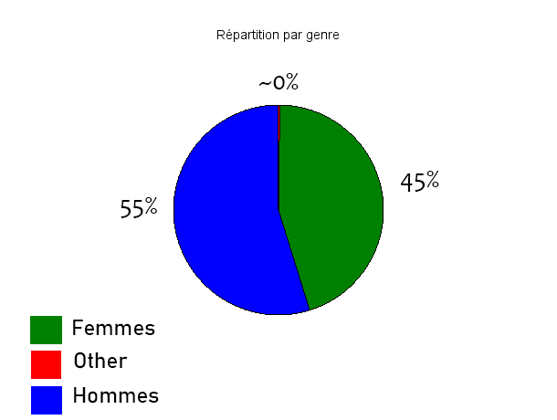
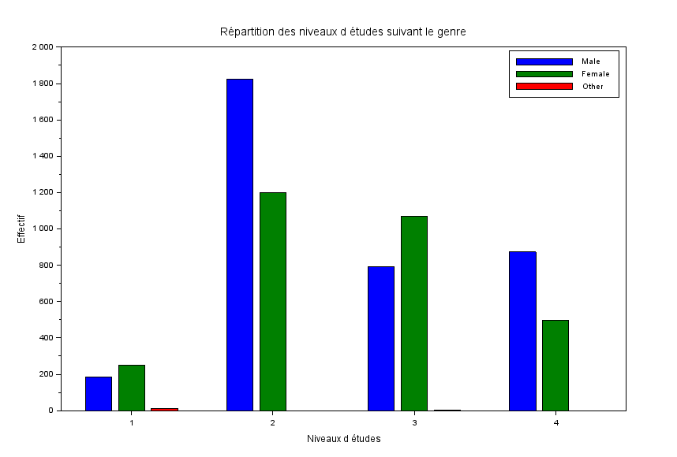
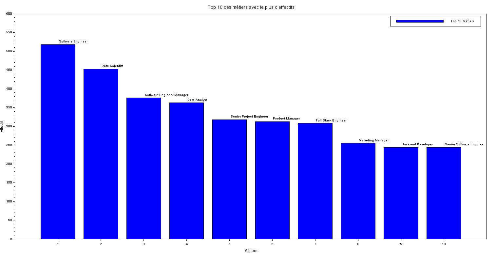

# EXO 1

## 1.1 Répartition des genres sous forme de camembert :

### Script Scilab :

Le fichier contenant le script est [camembertGenre.sce](camembertGenre.sce)

```scilab
path = '~/SAE_MATHS_23/data.csv';

// Lire le fichier CSV
data = read_csv(path, ',');

// Extraire la troisième colonne
column = data(:, 3);

// Compter les occurrences
male_count = sum(column == 'Male');
female_count = sum(column == 'Female');
other_count = sum(column == 'Other');
gender_data = [male_count, female_count, other_count];

// Créer le diagramme camembert
scf();
pie(gender_data); // Crée le diagramme camembert

// Ajouter des étiquettes au diagramme camembert
labels = ['Male', 'Female', 'Other'];
pie(gender_data, labels);

// Titre
xtitle('Répartition par genre');

// Exporter le diagramme en PNG
filename = 'camembertGenre.png';
xs2png(gcf(), filename);
```

### Diagramme :



## 1.2 Histogramme des niveaux d'études suivants le genre :

### Script Scilab :

Le fichier contenant le script est [histogramme.sce](histogramme.sce)

```scilab
// Chemin vers le fichier CSV
chemin = '~/SAE_MATHS_23/data.csv';

// Lire le fichier CSV
donnees = read_csv(chemin, ',');

// Extraire les colonnes des genres et des niveaux d'éducation
genres = donnees(:, 3);
niveaux = donnees(:, 4);

// Compter les occurrences pour chaque combinaison genre/niveau d'éducation
male_highschool = length(find(genres == "Male" & niveaux == "0"));
male_bachelor = length(find(genres == "Male" & niveaux == "1"));
male_master = length(find(genres == "Male" & niveaux == "2"));
male_phd = length(find(genres == "Male" & niveaux == "3"));

female_highschool = length(find(genres == "Female" & niveaux == "0"));
female_bachelor = length(find(genres == "Female" & niveaux == "1"));
female_master = length(find(genres == "Female" & niveaux == "2"));
female_phd = length(find(genres == "Female" & niveaux == "3"));

other_highschool = length(find(genres == "Other" & niveaux == "0"));
other_bachelor = length(find(genres == "Other" & niveaux == "1"));
other_master = length(find(genres == "Other" & niveaux == "2"));
other_phd = length(find(genres == "Other" & niveaux == "3"));

// Regrouper les données
donnees_groupées = [male_highschool, female_highschool, other_highschool; 
                    male_bachelor, female_bachelor, other_bachelor; 
                    male_master, female_master, other_master; 
                    male_phd, female_phd, other_phd];

// Créer l'histogramme
scf();
indices_niveaux = 1:4; // Indices pour les niveaux d'éducation
bar(indices_niveaux, donnees_groupées);

// Ajouter une légende
legend(['Male', 'Female', 'Other']);

// Ajouter un titre et des étiquettes pour les axes
xtitle('Répartition des niveaux d études suivant le genre', 'Niveaux d études', 'Effectif');

// Définir les étiquettes des x-axis manuellement
etiquettes_niveaux = ['High School', 'Bachelor', 'Master', 'PhD'];
xticks(indices_niveaux, etiquettes_niveaux);
```


### Histogramme :



## 1.3 Effectifs des 10 professions les plus représentées :

### Script Scilab :

Le fichier contenant le script est [effectifhistogramme.sce](effectifhistogramme.sce)

```scilab
// Chemin vers le fichier CSV
chemin = '~/SAE_MATHS_23/data.csv';

// Lire le fichier CSV
donnees = read_csv(chemin, ',');

// Extraire la colonne des métiers
metiers = donnees(:, 5);

// Compter les occurrences de chaque métier
occurrences_metiers = tabul(metiers, 'i');
noms_metiers = occurrences_metiers(1);
effectifs_metiers = occurrences_metiers(2);

// Trier les métiers par nombre d'occurrences décroissant
[effets_tries, indices_tries] = gsort(effectifs_metiers, 'g', 'd');
top10_metiers = noms_metiers(indices_tries(1:10));
effectifs_top10 = effets_tries(1:10);

// Créer l'histogramme des top 10 métiers
scf();
indices_top10 = 1:10;
bar(indices_top10, effectifs_top10);

// Ajouter une légende et un titre
legend(['Top 10 Métiers']);
xtitle('Top 10 des métiers avec le plus d''effectifs', 'Métiers', 'Effectif');

// Annoter les noms des métiers sur l'axe des x
xstring(indices_top10, effectifs_top10, top10_metiers);
```


### Histogramme :



## 1.4 Profession la plus fréquente des femmes et des hommes :

### Script Scilab :

Le fichier contenant le script est [profession.sce](profession.sce)
```scilab
// Chemin vers le fichier CSV
path = '~/SAE_MATHS_23/data.csv';

// Lire le fichier CSV
data = read_csv(path, ',');

// Extraire les colonnes pertinentes
genders = data(:, 3);
professions = data(:, 5);

// Séparer les données par genre
male_professions = professions(genders == 'Male');
female_professions = professions(genders == 'Female');

// Trouver la profession la plus fréquente pour les hommes
unique_male_professions = unique(male_professions);
male_counts = [];
for i = 1:size(unique_male_professions, '*')
    male_counts(i) = sum(male_professions == unique_male_professions(i));
end
[max_male_count, max_male_index] = max(male_counts);
most_frequent_male_profession = unique_male_professions(max_male_index);

// Trouver la profession la plus fréquente pour les femmes
unique_female_professions = unique(female_professions);
female_counts = [];
for i = 1:size(unique_female_professions, '*')
    female_counts(i) = sum(female_professions == unique_female_professions(i));
end
[max_female_count, max_female_index] = max(female_counts);
most_frequent_female_profession = unique_female_professions(max_female_index);

// Afficher les résultats
disp("La profession la plus fréquente des hommes est : " + most_frequent_male_profession);
disp("La profession la plus fréquente des femmes est : " + most_frequent_female_profession);
```

### Réponses :

- **La profession la plus fréquente des hommes est :** Software Engineer
- **La profession la plus fréquente des femmes est :** Data Scientist

## 1.5 Salaire, âge et expérience moyenne pour chaque niveau d'études :

### Script Scilab :

Le fichier contenant le script est [etudes.sce](etudes.sce)

```scilab
// Chemin vers le fichier CSV
path = '~/SAE_MATHS_23/data.csv';

// Lire le fichier CSV
data = read_csv(path, ',');

// Extraire les colonnes pertinentes
levels = data(:, 4);
ages = strtod(data(:, 2)); // Convertir les âges en nombres
salaries = strtod(data(:, 7)); // Convertir les salaires en nombres
experiences = strtod(data(:, 6)); // Convertir les expériences en nombres


// Identifier les différents niveaux d'études
unique_levels = unique(levels);

// Initialiser les matrices pour stocker les moyennes
avg_salaries = [];
avg_ages = [];
avg_experiences = [];

// Calculer les moyennes pour chaque niveau d'études
for i = 1:size(unique_levels, '*')
    level = unique_levels(i);
    indices = find(levels == level);
    
    avg_salaries(i) = mean(salaries(indices));
    avg_ages(i) = mean(ages(indices));
    avg_experiences(i) = mean(experiences(indices));
end

// Afficher les résultats
for i = 1:size(unique_levels, '*')
    level = unique_levels(i);
    if level <> '' then // Ignorer la ligne sans valeur de niveau d'études
        disp("Niveau d études : " + string(level));
        disp("Salaire moyen : " + string(avg_salaries(i)));
        disp("Âge moyen : " + string(avg_ages(i)));
        disp("Expérience moyenne : " + string(avg_experiences(i)));
        disp(" ");
    end
end

```

### Réponses :

- **Niveau d'études :** 0
- **Salaire moyen :** 36706.694
- **Âge moyen :** 26.854911
- **Expérience moyenne :** 1.9151786

----------

- **Niveau d'études :** 1
- **Salaire moyen :** 95082.909
- **Âge moyen :** 30.260179
- **Expérience moyenne :** 5.4195631

----------

- **Niveau d'études :** 2
- **Salaire moyen :** 130112.06
- **Âge moyen :** 35.171505
- **Expérience moyenne :** 9.6456989

----------

- **Niveau d'études :** 3
- **Salaire moyen :** 165651.46
- **Âge moyen :** 41.154858
- **Expérience moyenne :** 13.915267

----------


## 1.6 Salaire et âge moyen et expérience moyenne pour chaque genre :

### Script Scilab :

Le fichier contenant le script est [genre.sce](genre.sce)

```scilab
// Chemin vers le fichier CSV
path = '~/SAE_MATHS_23/data.csv';

// Lire le fichier CSV
data = read_csv(path, ',');

// Extraire les colonnes pertinentes
levels = data(:, 4);
ages = strtod(data(:, 2)); // Convertir les âges en nombres
salaries = strtod(data(:, 7)); // Convertir les salaires en nombres
experiences = strtod(data(:, 6)); // Convertir les expériences en nombres


// Identifier les différents niveaux d'études
unique_levels = unique(levels);

// Initialiser les matrices pour stocker les moyennes
avg_salaries = [];
avg_ages = [];
avg_experiences = [];

// Calculer les moyennes pour chaque niveau d'études
for i = 1:size(unique_levels, '*')
    level = unique_levels(i);
    indices = find(levels == level);
    
    avg_salaries(i) = mean(salaries(indices));
    avg_ages(i) = mean(ages(indices));
    avg_experiences(i) = mean(experiences(indices));
end

// Afficher les résultats
for i = 1:size(unique_levels, '*')
    level = unique_levels(i);
    if level <> '' then // Ignorer la ligne sans valeur de niveau d'études
        disp("Niveau d études : " + string(level));
        disp("Salaire moyen : " + string(avg_salaries(i)));
        disp("Âge moyen : " + string(avg_ages(i)));
        disp("Expérience moyenne : " + string(avg_experiences(i)));
        disp(" ");
    end
end

```
### Réponses :

**Genre : Male**

- **Salaire moyen :** 121389.87
- **Âge moyen :** 34.416394
- **Expérience moyenne :** 8.6169662

----------

**Genre : Female**

- **Salaire moyen :** 107889
- **Âge moyen :** 32.626286
- **Expérience moyenne :** 7.4201792

----------

