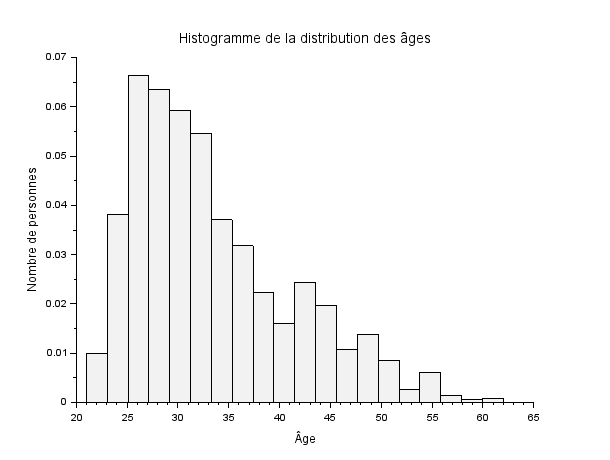
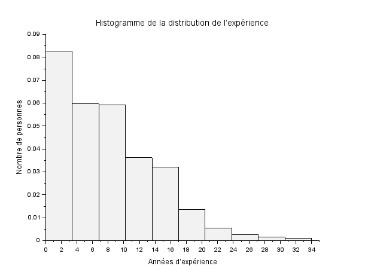
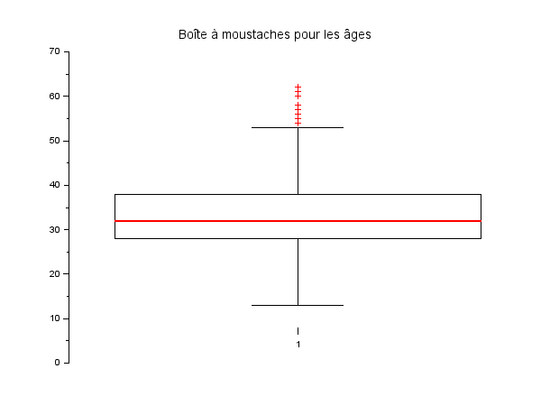
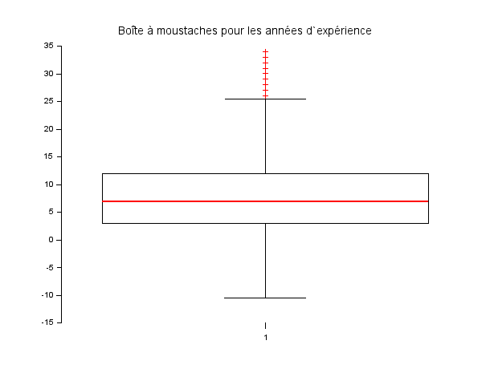

# EXO 2

## 2.1 : Distribution des âges :

### Script Scilab :

Le fichier contenant le script est [distributionAges.sce](distributionAges.sce)

```scilab
path = '~/Scilab/data.csv';


// Lire le fichier CSV
data = csvRead(path, ',', 'double'); 

// Extraire la colonne des âges qui est la deuxième colonne
ages = data(:, 2);

// Histogramme des âges
scf(); 
histplot(20, ages);

// Ajouter un titre et des étiquettes aux axes
xtitle('Histogramme de la distribution des âges', 'Âge', 'Nombre de personnes');

// Exporter le diagramme en format PNG
filename = 'distributionAges.png'; 
xs2png(gcf(), filename);
```

### Histogramme :



## 2.2 : Distribution de l'expérience :

### Script Scilab :

Le fichier contenant le script est [distributionExperience.sce](distributionExperience.sce)

```scilab
// Chemin vers le fichier CSV
path = '~/Scilab/data.csv';


data = csvRead(path, ',', 'double'); // Lire les données en tant que doubles

// Extraire la colonne de l'expérience (sixième colonne)
experience = data(:, 6);
scf(); 
histplot(10, experience); 

// Titre et étiquettes
xtitle('Histogramme de la distribution de l’expérience', 'Années d’expérience', 'Nombre de personnes');

// Exporter l'histogramme en PNG
filename = 'distributionExperience.png';
xs2png(gcf(), filename);
```

### Histogramme :



## 2.3 : Quartiles, interquatiles, min,max, moyenne, mediane, mode, et ecart type de l'age :

### Script Scilab :

Le fichier contenant le script est [donnéesAge.sce](donnéesAge.sce)

```scilab
path = '~/Scilab/data.csv';

data = csvRead(path, ',', 'double'); // Assurez-vous que les données sont lues comme des nombres réels

// Extraire la colonne des âges qui est la deuxième colonne
ages = data(:, 2);

// Calculer les mesures statistiques de base
min_age = min(ages); // Minimum
max_age = max(ages); // Maximum
mean_age = mean(ages); // Moyenne
median_age = median(ages); // Médiane

// Calcul du mode
unique_ages = unique(ages, "r");
count_ages = zeros(unique_ages);

for i = 1:size(unique_ages, "r")
    count_ages(i) = sum(ages == unique_ages(i));
end

[max_count, index] = max(count_ages);
mode_age = unique_ages(index);

// Écart type
std_dev_age = stdev(ages);

// Calcul des quartiles
sorted_ages = gsort(ages, 'g', 'i'); // Tri croissant des âges
n = size(sorted_ages, 'r');
q1 = sorted_ages(round(0.25 * n));
q2 = median_age; // Médiane est également le deuxième quartile
q3 = sorted_ages(round(0.75 * n));
iqr_age = q3 - q1; // Écart interquartile

// Affichage des résultats
disp("Statistiques descriptives de l`âge :");
disp("Minimum : " + string(min_age));
disp("Maximum : " + string(max_age));
disp("Moyenne : " + string(mean_age));
disp("Médiane : " + string(median_age));
disp("Mode : " + string(mode_age));
disp("Écart type : " + string(std_dev_age));
disp("Premier quartile (Q1) : " + string(q1));
disp("Médiane (Q2) : " + string(q2));
disp("Troisième quartile (Q3) : " + string(q3));
disp("Écart interquartile (IQR) : " + string(iqr_age));
```
### Réponses :

- **Premier Quartile :** 28
- **Médiane (Deuxième Quartile) :** 32
- **Troisième Quartile :** 38
- **Minimum :** 21
- **Maximum :** 62
- **Moyenne :** 33.622033
- **Mode :** 27
- **Ecart Type :** 7.6156456

## 2.4 : Boîte à moustache pour l'âge :

### Script Scilab :

Le fichier contenant le script est [moustacheAge.sce](moustacheAge.sce)

```scilab
path = '~/Scilab/data.csv';

data = csvRead(path, ',', 'double'); // Assurez-vous que les données sont lues comme des nombres réels

// Extraire la colonne des âges qui est la deuxième colonne
ages = data(:, 2);

// Tracer la boîte à moustaches pour les âges
scf(); 
boxplot(ages); 

// Titre
xtitle("Boîte à moustaches pour les âges");

// Exporter le diagramme en format PNG
filename = 'moustacheAge.png';
xs2png(gcf(), filename);
```

### Boîte à moustache :



## 2.5 : Expérience :

### Quartiles, interquatiles, min,max, moyenne, mediane, mode, et ecart type de l'expérience :

### Script Scilab :

Le fichier contenant le script est [donéesExperience.sce](donéesExperience.sce)

```scilab
path = '~/Scilab/data.csv';

data = csvRead(path, ',', 'double'); // Assurez-vous que les données sont lues comme des nombres réels

// Extraire la colonne des années d'expérience qui est la sixième colonne
experience = data(:, 6);

// Calculer les mesures statistiques de base pour l'expérience
min_exp = min(experience); // Minimum
max_exp = max(experience); // Maximum
mean_exp = mean(experience); // Moyenne
median_exp = median(experience); // Médiane

// Calcul du mode pour l'expérience
unique_exp = unique(experience, "r");
count_exp = zeros(unique_exp);

for i = 1:size(unique_exp, "r")
    count_exp(i) = sum(experience == unique_exp(i));
end

[max_count, index] = max(count_exp);
mode_exp = unique_exp(index);

// Écart type
std_dev_exp = stdev(experience);

// Calcul des quartiles pour l'expérience
sorted_exp = gsort(experience, 'g', 'i'); // Tri croissant des années d'expérience
n = size(sorted_exp, 'r');
q1_exp = sorted_exp(round(0.25 * n));
q2_exp = median_exp; // Médiane est également le deuxième quartile
q3_exp = sorted_exp(round(0.75 * n));
iqr_exp = q3_exp - q1_exp; // Écart interquartile

// Affichage des résultats
disp("Statistiques descriptives des années d`expérience :");
disp("Minimum : " + string(min_exp));
disp("Maximum : " + string(max_exp));
disp("Moyenne : " + string(mean_exp));
disp("Médiane : " + string(median_exp));
disp("Mode : " + string(mode_exp));
disp("Écart type : " + string(std_dev_exp));
disp("Premier quartile (Q1) : " + string(q1_exp));
disp("Médiane (Q2) : " + string(q2_exp));
disp("Troisième quartile (Q3) : " + string(q3_exp));
disp("Écart interquartile (IQR) : " + string(iqr_exp));
```

### Réponses :

- **Premier Quartile :** 3
- **Médiane (Deuxième Quartile) :** 7
- **Troisième Quartile :** 12
- **Minimum :** 0
- **Maximum :** 34
- **Moyenne :** 8.0950142
- **Mode :** 2
- **Ecart Type :** 6.0598534

### Boîte à moustache pour l'expérience :

### Script Scilab :

Le fichier contenant le script est [moustacheExperience.sce](moustacheExperience.sce)

```scilab
path = '~/Scilab/data.csv';

data = csvRead(path, ',', 'double');

// Extraire la colonne des années d'expérience qui est la sixième colonne
experience = data(:, 6);

// Tracer la boîte à moustaches pour les années d'expérience
scf();  
boxplot(experience);  

// Titre
xtitle("Boîte à moustaches pour les années d`expérience");

// Exporter le diagramme en format PNG
filename = 'moustacheExperience.png';
xs2png(gcf(), filename);  // Exporte la figure en PNG
```

### Boîte à moustache :


