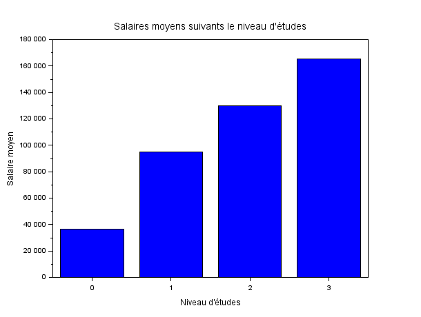

# EXO 3

## 3.1 : Distribution des salaires selon le genre :

### Script Scilab :

Le fichier contenant le script est [distributionSalairesGenres.sce](distributionSalairesGenres.sce)

```scilab
// Lire le fichier CSV
data = csvRead('~/SAE_MATHS_23/data.csv', ',', '.', 'string');

// Extraire les colonnes nécessaires
salaire = evstr(data(:, 7));
genre = data(:, 3);

// Définir les genres uniques
unique_genres = ['Male'; 'Female'; 'Other'];

// Extraire les salaires pour chaque genre
salaire_hommes = salaire(find(genre == unique_genres(1, 1)));
salaire_femmes = salaire(find(genre == unique_genres(2, 1)));
salaire_other = salaire(find(genre == unique_genres(3, 1)));

// Créer les histogrammes pour chaque genre
scf();

subplot(3, 1, 1);
histplot(10, salaire_hommes, style=2);
xtitle('Distribution des salaires pour les hommes', 'Salaire', 'Effectif');

subplot(3, 1, 2);
histplot(10, salaire_femmes, style=5);
xtitle('Distribution des salaires pour les femmes', 'Salaire', 'Effectif');

subplot(3, 1, 3);
histplot(10, salaire_other);
xtitle('Distribution des salaires pour les autres', 'Salaire', 'Effectif');

// Exporter le graphique en PNG
filename = 'distribution_salaires_genres.png';
xs2png(gcf(), filename);

```

### Histogramme :


## 3.2 : Salaires moyens selon le niveau d'étude :

### Script Scilab :

Le fichier contenant le script est [salaireNiveauEtudes.sce](salaireNiveauEtudes.sce)

```scilab
// Lire le fichier CSV
data = read_csv('~/SAE_MATHS_23/data.csv', ',');

// Extraire les colonnes nécessaires
salaire = evstr(data(:, 7));
niveauxEtudes = data(:, 4);

// Définir les niveaux d'études uniques
unique_etude = [0, 1, 2, 3];

// Calculer les salaires moyens pour chaque niveau d''études
salaire0 = mean(salaire(find(niveauxEtudes == string(unique_etude(1, 1)))));
salaire1 = mean(salaire(find(niveauxEtudes == string(unique_etude(1, 2)))));
salaire2 = mean(salaire(find(niveauxEtudes == string(unique_etude(1, 3)))));
salaire3 = mean(salaire(find(niveauxEtudes == string(unique_etude(1, 4)))));

salaires = [salaire0; salaire1; salaire2; salaire3];

// Créer le diagramme à barres
scf();
bar(unique_etude, salaires);

// Titre et étiquettes des axes
xtitle("Salaires moyens suivants le niveau d''études", "Niveau d''études", "Salaire moyen");

// Exporter le diagramme en PNG
filename = 'salaireNiveauEtudes.png';
xs2png(gcf(), filename);
```

### Histogramme :



## 3.3 : Quartiles, interquatiles, min,max, moyenne, mediane, ecart type et boîte à moustache des salaires.

### Quartiles, interquatiles, min,max, moyenne, mediane, mode, et ecart type des salaires :

### Script Scilab :

Le fichier contenant le script est [donnéesSalaire.sce](donnéesSalaire.sce)

```scilab
path = '~/SAE_MATHS_23/data.csv';
data = csvRead(path, ',', 'double'); 
salaries = data(:, 7);

min_salary = min(salaries); // Minimum
max_salary = max(salaries); // Maximum
mean_salary = mean(salaries); // Moyenne
median_salary = median(salaries); // Médiane

// Calcul du mode
unique_salaries = unique(salaries, "r");
count_salaries = zeros(unique_salaries);

for i = 1:size(unique_salaries, "r")
    count_salaries(i) = sum(salaries == unique_salaries(i));
end

[max_count, index] = max(count_salaries);
mode_salary = unique_salaries(index);

// Écart type
std_dev_salary = stdev(salaries);

// Calcul des quartiles
sorted_salaries = gsort(salaries, 'g', 'i'); // Tri croissant des salaires
n = size(sorted_salaries, 'r');
q1 = sorted_salaries(round(0.25 * n));
q2 = median_salary; // Médiane est également le deuxième quartile
q3 = sorted_salaries(round(0.75 * n));
iqr_salary = q3 - q1; // Écart interquartile

// Affichage des résultats
disp("Statistiques descriptives des salaires :");
disp("Minimum : " + string(min_salary));
disp("Maximum : " + string(max_salary));
disp("Moyenne : " + string(mean_salary));
disp("Médiane : " + string(median_salary));
disp("Mode : " + string(mode_salary));
disp("Écart type : " + string(std_dev_salary));
disp("Premier quartile (Q1) : " + string(q1));
disp("Médiane (Q2) : " + string(q2));
disp("Troisième quartile (Q3) : " + string(q3));
disp("Écart interquartile (IQR) : " + string(iqr_salary));
```

### Réponses :

- **Premier Quartile :** 70000
- **Médiane (Deuxième Quartile) :** 115000
- **Troisième Quartile :** 160000
- **Interquatiles :** 90000
- **Minimum :** 350
- **Maximum :** 250000
- **Moyenne :** 115326.96
- **Ecart Type :** 52786.184

### Boîte à moustache pour les salaires :

### Script Scilab :

Le fichier contenant le script est [moustacheSalaire.sce](moustacheSalaire.sce)

```scilab
path = '~/SAE_MATHS_23/data.csv';
data = csvRead(path, ',', 'double'); 

// Extraire la colonne des salaires qui est la septieme colonne
salaries = data(:, 7);

// Tracer la boîte à moustaches pour les salaires
scf(); 
boxplot(salaries); 

// Titre
xtitle("Boîte à moustaches pour les salaires");

// Exporter le diagramme en format PNG
filename = 'moustacheSalaire.png';
xs2png(gcf(), filename);
```

### Boîte à moustache :


## 3.4 : Quartiles, interquatiles, min,max, moyenne, mediane, et ecart type des salaires selon les genres :

Le fichier contenant le script est [boiteMoustacheGenre.sce](boiteMoustacheGenre.sce)

```scilab
// Lire le fichier CSV
data = read_csv('~/SAE_MATHS_23/data.csv', ',');

// Extraire les colonnes nécessaires
salaire = evstr(data(:, 7));
genre = data(:, 3);

// Définir les genres uniques
unique_genres = ['Male'; 'Female'; 'Other'];

// Initialiser les tableaux pour les statistiques
minsalaire = zeros(1, size(unique_genres, 1));
maxsalaire = zeros(1, size(unique_genres, 1));
moysalaire = zeros(1, size(unique_genres, 1));
medsalaire = zeros(1, size(unique_genres, 1));
intersalaire = zeros(1, size(unique_genres, 1));
quartsalaire = zeros(size(unique_genres, 1), 3); // Pour les quartiles (Q1, Q2, Q3)
ecarttypesalaire = zeros(1, size(unique_genres, 1));

// Fonction pour calculer les quartiles
function q = quartiles(x)
    x = gsort(x, 'g', 'i');
    n = length(x);
    q1 = x(floor(0.25 * (n + 1)));
    q2 = median(x);
    q3 = x(floor(0.75 * (n + 1)));
    q = [q1, q2, q3];
endfunction

// Calculer les statistiques pour chaque genre
for i = 1:size(unique_genres, 1)
    genre_salaire = salaire(find(strcmp(genre, unique_genres(i, :))));
    
    minsalaire(i) = min(genre_salaire);
    maxsalaire(i) = max(genre_salaire);
    moysalaire(i) = mean(genre_salaire);
    medsalaire(i) = median(genre_salaire);
    intersalaire(i) = iqr(genre_salaire);
    quartsalaire(i, :) = quartiles(genre_salaire);
    ecarttypesalaire(i) = stdev(genre_salaire);
    
    // Créer le diagramme boîte à moustaches pour chaque genre
    scf();
    boxplot(genre_salaire);
    xtitle("Boîte à moustaches des salaires des " + string(unique_genres(i, :)), "Salaire", "Valeur");
    
    // Exporter chaque diagramme en PNG
    filename = 'boiteMoustache_' + string(unique_genres(i, :)) + '.png';
    xs2png(gcf(), filename);
end

// Afficher les statistiques calculées
disp("Min Salaires: " + string(minsalaire));
disp("Max Salaires: " + string(maxsalaire));
disp("Moyenne Salaires: " + string(moysalaire));
disp("Médiane Salaires: " + string(medsalaire));
disp("Intervalle Interquartile: " + string(intersalaire));
disp("Écart-type Salaires: " + string(ecarttypesalaire));
```

### Données selon les genres :

### Hommes

- **Premier Quartile :** 60000
- **Médiane (Deuxième Quartile) :** 105000
- **Troisième Quartile :** 150000
- **Interquatiles :** 90000
- **Minimum :** 500
- **Maximum :** 22000
- **Moyenne :** 107972.16
- **Ecart Type :** 52695.505

### Femmes

- **Premier Quartile :** 75000
- **Médiane (Deuxième Quartile) :** 120000
- **Troisième Quartile :** 170000
- **Interquatiles :** 95000
- **Minimum :** 350
- **Maximum :** 250000
- **Moyenne :** 121406.89
- **Ecart Type :** 52060.77

### Autres

- **Premier Quartile :** 70000
- **Médiane (Deuxième Quartile) :** 115000
- **Troisième Quartile :** 160000
- **Interquatiles :** 90000
- **Minimum :** 350
- **Maximum :** 250000
- **Moyenne :** 115304.89
- **Ecart Type :** 52803.192

### Boîte à moustache pour les Hommes :


### Boîte à moustache pour les Femmes :


### Boîte à moustache pour Other :

