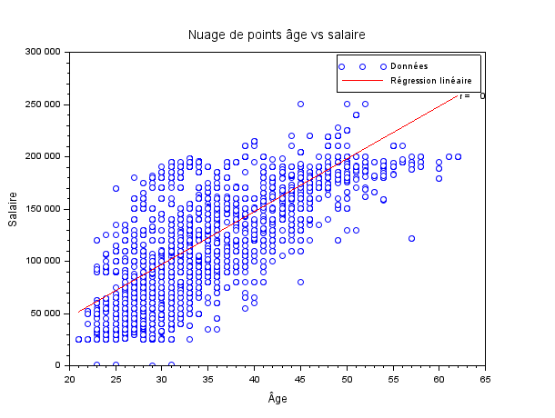
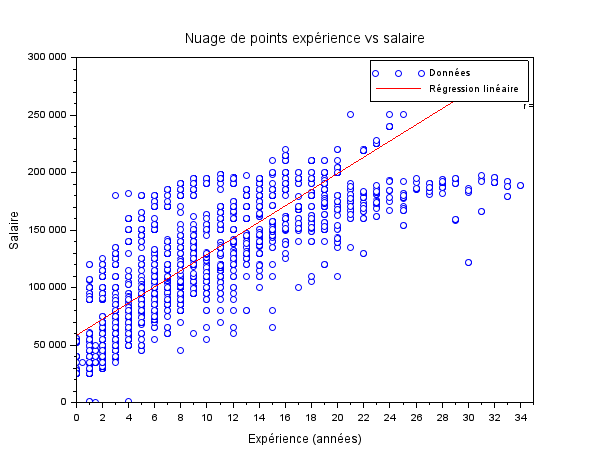

# EXO 4

## 4.1 : Nuage de points (age,salaire), et la droite de regression correspondante.

### Script Scilab :

Le fichier contenant le script est [regressionAgeSalaire.sce](regressionAgeSalaire.sce)

```scilab
// Chemin du fichier CSV
path = '~/SAE_MATHS_23/data.csv';

// Lire le fichier CSV
data = csvRead(path, ',', 'double');

// Extraire les colonnes d'âge et de salaire
age_column = data(:, 2); // Âge est dans la 2ème colonne
salary_column = data(:, 7); // Salaire est dans la 7ème colonne

// Tracer le nuage de points
scf(); // Ouvre une nouvelle fenêtre graphique
plot(age_column, salary_column, 'bo'); // Trace des points en bleu
xtitle('Nuage de points âge vs salaire', 'Âge', 'Salaire');

// Calculer la droite de régression avec polyfit
degree = 1; // Degré de la régression linéaire
coefficients = polyfit(age_column, salary_column, degree); // Calcul des coefficients de la régression linéaire
a = coefficients(1); // Pente
b = coefficients(2); // Intercept

// Tracer la droite de régression
x = linspace(min(age_column), max(age_column), 100); // Génère des valeurs d'âge réparties uniformément
y = polyval(coefficients, x); // Calcule les valeurs de salaire correspondantes avec polyfit
plot(x, y, 'r'); // Trace la droite en rouge
legend(['Données', 'Régression linéaire']);

// Calculer le coefficient de corrélation manuellement
n = length(age_column);
sum_x = sum(age_column);
sum_y = sum(salary_column);
sum_xy = sum(age_column .* salary_column);
sum_x2 = sum(age_column.^2);
sum_y2 = sum(salary_column.^2);

numerator = n*sum_xy - sum_x*sum_y;
denominator = sqrt((n*sum_x2 - sum_x^2) * (n*sum_y2 - sum_y^2));

correlation_coefficient = numerator / denominator;
disp(['Coefficient de corrélation : ', string(correlation_coefficient)]);

// Affichage du coefficient sur le graphique
xstring(max(age_column), max(salary_column), ['r = ', string(correlation_coefficient)]);

// Exporter le graphique en format PNG
filename = 'age_salary_regression.png'; 
xs2png(gcf(), filename);
```

### Nuage de points & droite de regression :



### Réponse :
 
- **Coefficient de corrélation :** 0.7280526

## 4.2 : Nuage de points (expérience,salaire), et la droite de regression correspondante.

### Script Scilab :

Le fichier contenant le script est [regressionExperienceSalaire.sce](regressionExperienceSalaire.sce)

```scilab
// Chemin du fichier CSV
path = '~/SAE_MATHS_23/data.csv';

// Lire le fichier CSV
data = csvRead(path, ',', 'double');

// Extraire les colonnes d'expérience et de salaire
experience_column = data(:, 6); // Expérience est dans la 6ème colonne
salary_column = data(:, 7); // Salaire est dans la 7ème colonne

// Tracer le nuage de points
scf(); // Ouvre une nouvelle fenêtre graphique
plot(experience_column, salary_column, 'bo'); // Trace des points en bleu
xtitle('Nuage de points expérience vs salaire', 'Expérience (années)', 'Salaire');

// Calculer la droite de régression avec polyfit
degree = 1; // Degré de la régression linéaire
coefficients = polyfit(experience_column, salary_column, degree); // Calcul des coefficients de la régression linéaire
a = coefficients(1); // Pente
b = coefficients(2); // Intercept

// Tracer la droite de régression
x = linspace(min(experience_column), max(experience_column), 100); // Génère des valeurs d'expérience réparties uniformément
y = polyval(coefficients, x); // Calcule les valeurs de salaire correspondantes avec polyfit
plot(x, y, 'r'); // Trace la droite en rouge
legend(['Données', 'Régression linéaire']);

// Calculer le coefficient de corrélation manuellement
n = length(experience_column);
sum_x = sum(experience_column);
sum_y = sum(salary_column);
sum_xy = sum(experience_column .* salary_column);
sum_x2 = sum(experience_column.^2);
sum_y2 = sum(salary_column.^2);

numerator = n*sum_xy - sum_x*sum_y;
denominator = sqrt((n*sum_x2 - sum_x^2) * (n*sum_y2 - sum_y^2));

correlation_coefficient = numerator / denominator;
disp(['Coefficient de corrélation : ', string(correlation_coefficient)]);

// Affichage du coefficient sur le graphique
xstring(max(experience_column), max(salary_column), ['r = ', string(correlation_coefficient)]);

// Exporter le graphique en format PNG
filename = 'experience_salary_regression.png'; 
xs2png(gcf(), filename);
```

### Nuage de points & droite de regression :



### Réponse :
 
- **Coefficient de corrélation :** 0.8089689