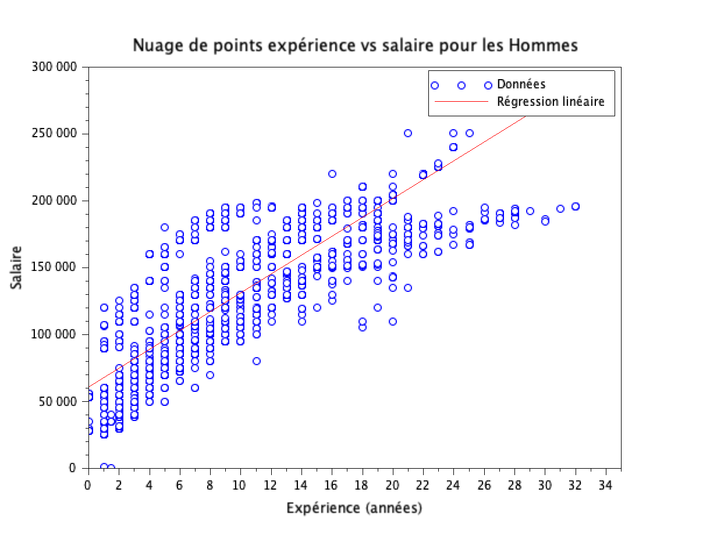
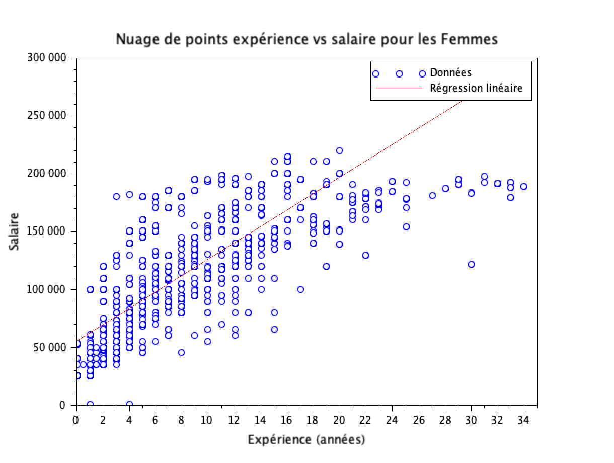
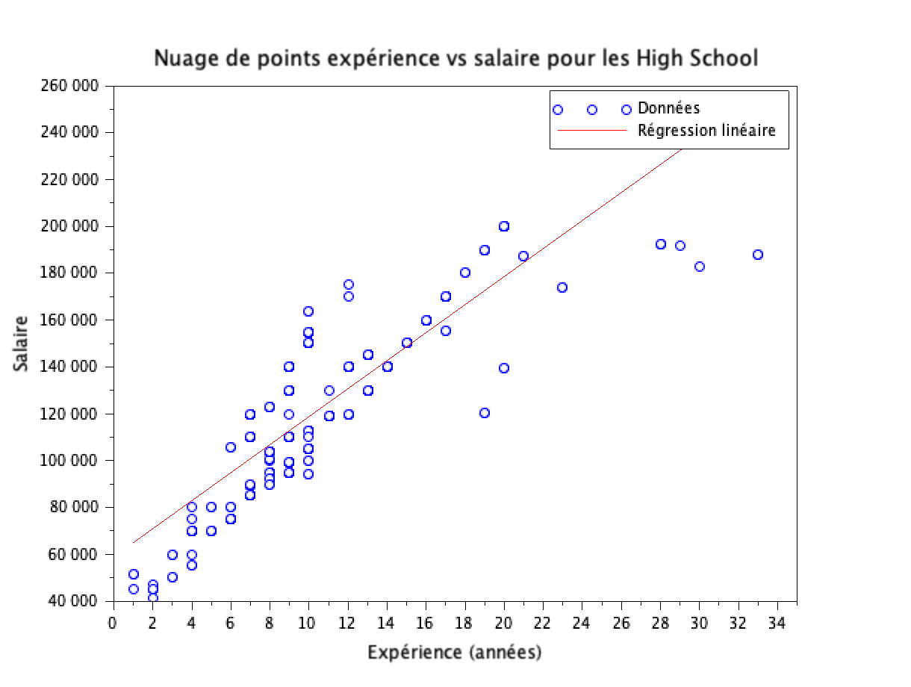
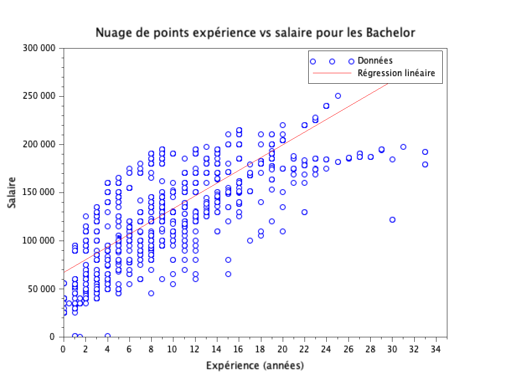
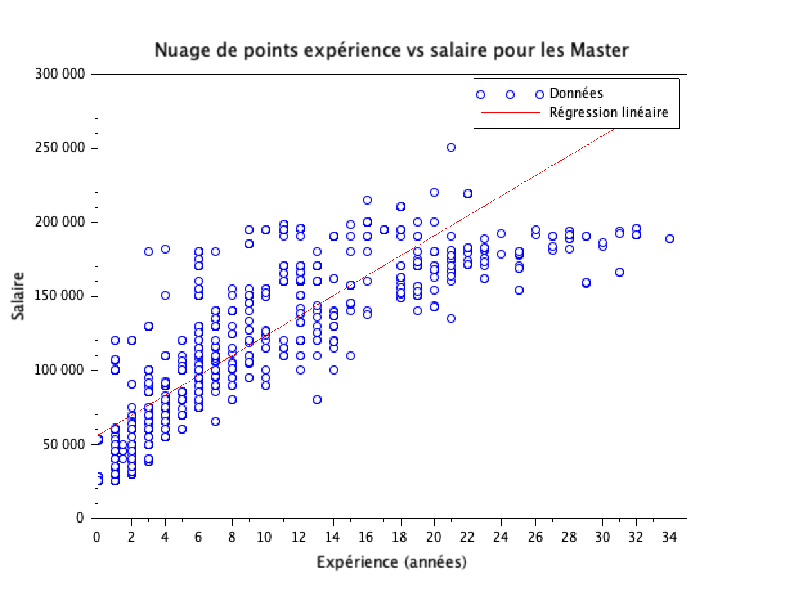
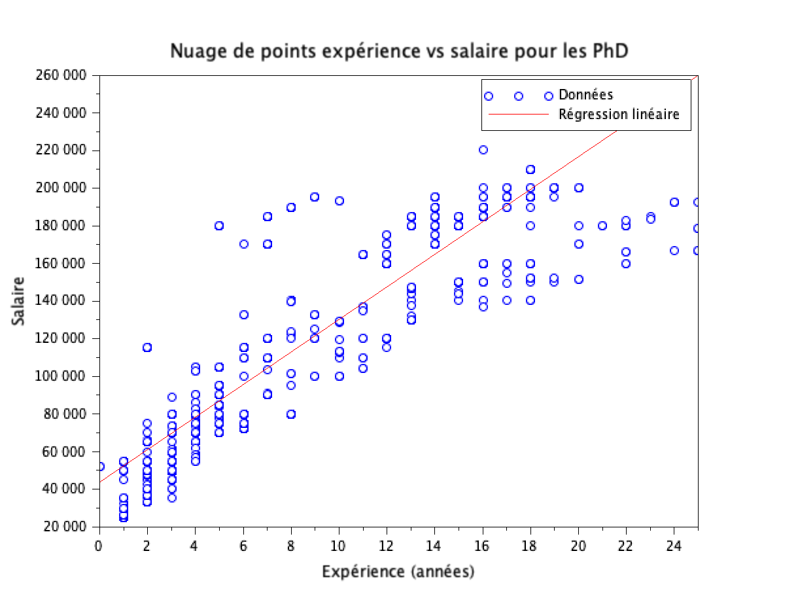

# EXO 5

## 5.1 : Nuage de points (salaire,expérience) pour les hommes et les femmes, ainsi que les droites de regression associées.

### Script Scilab pour les Femmes et les Hommes :

Le fichier contenant le script est [régressionSalaireExpérienceGenre.sce](régressionSalaireExpérienceGenre.sce)

```scilab
// Chemin vers le fichier CSV
chemin = '~/Scilab/data.csv';

// Lire le fichier CSV
donnees = read_csv(chemin, ',');

// Extraire les colonnes des genres, expérience et salaire
genres = donnees(:, 3);
experience = donnees(:, 6);
salaire = donnees(:, 7);

// Conversion des données numériques
experience = evstr(experience);
salaire = evstr(salaire);

// Fonction pour analyser et tracer les données pour un genre spécifié
function analyseGenre(genre_label, couleur_point, nom_fichier)
    // Trouver les indices pour le genre spécifié
    indices = find(genres == genre_label);
    experience_genre = experience(indices);
    salaire_genre = salaire(indices);

    // Tracer le nuage de points
    scf(); // Ouvre une nouvelle fenêtre graphique
    plot(experience_genre, salaire_genre, couleur_point); // Trace des points
    xtitle(['Nuage de points expérience vs salaire pour ', genre_label], 'Expérience (années)', 'Salaire');

    // Calculer et tracer la droite de régression
    coefficients = polyfit(experience_genre, salaire_genre, 1); // Régression linéaire
    a = coefficients(1); // Pente
    b = coefficients(2); // Intercept
    x = linspace(min(experience_genre), max(experience_genre), 100);
    y = polyval(coefficients, x);
    plot(x, y, 'r'); // Trace la droite en rouge
    legend(['Données', 'Régression linéaire']);

    // Exporter le graphique en format PNG
    xs2png(gcf(), nom_fichier);
endfunction

// Appel de la fonction pour les hommes
analyseGenre('Male', 'bo', 'régressionSalaireExpérienceHomme.png');

// Appel de la fonction pour les femmes
analyseGenre('Female', 'bo', 'régressionSalaireExpérienceFemme.png');
```

### Nuage de points :





### Commentaire

L'expérience semble être étroitement lié avec le salaire.
En général le salaire augmente avec les années d'expérience.
Cette tendance est facilement observable chez les Hommes mais chez les Femmes il y a toujours des points qui ne semblent pas suivre ce fonctionnement.

## 5.2 : Nuage de points (salaire,expérience) et les droites de regression associées pour chaque niveau d'études. Commentaire ?

### Script Scilab :

Le fichier contenant le script est [régressionExpérienceSalaireEtude.sce](régressionExpérienceSalaireEtude.sce)

```scilab
// Chemin vers le fichier CSV
chemin = '~/Scilab/data.csv';

// Lire le fichier CSV
donnees = read_csv(chemin, ',');

// Extraire les colonnes des diplômes, expérience et salaire
diplome = donnees(:, 4);
experience = donnees(:, 6);
salaire = donnees(:, 7);

// Conversion des types de données, si nécessaire
diplome = evstr(diplome);
experience = evstr(experience);
salaire = evstr(salaire);

// Fonction pour tracer et exporter les graphiques
function plotAndExport(data_index, degree_title, file_name)
    experience_level = experience(data_index);
    salaire_level = salaire(data_index);

    scf(); // Ouvre une nouvelle fenêtre graphique
    plot(experience_level, salaire_level, 'bo'); // Trace des points en bleu
    xtitle(['Nuage de points expérience vs salaire pour les ', degree_title], 'Expérience (années)', 'Salaire');

    // Régression linéaire
    degree = 1; // Degré de la régression linéaire
    coefficients = polyfit(experience_level, salaire_level, degree);
    x = linspace(min(experience_level), max(experience_level), 100);
    y = polyval(coefficients, x);
    plot(x, y, 'r'); // Trace la droite en rouge
    legend(['Données', 'Régression linéaire']);

    // Exporter le graphique
    xs2png(gcf(), file_name);
endfunction

// Indices pour chaque niveau de diplôme
indice_phd = find(diplome == 3);
indice_master = find(diplome == 2);
indice_bachelor = find(diplome == 1);
indice_highschool = find(diplome == 0);

// Appels de fonction pour chaque niveau de diplôme
plotAndExport(indice_phd, 'PhD', 'régressionSalaireExpériencePhd.png');
plotAndExport(indice_master, 'Master', 'régressionSalaireExpérienceMaster.png');
plotAndExport(indice_bachelor, 'Bachelor', 'régressionSalaireExpérienceBachelor.png');
plotAndExport(indice_highschool, 'High School', 'régressionSalaireExpérienceHighschool.png');
```

### Nuage de points pour les différents niveaux d'étude:









### Commentaire

L'analyse des graphiques montre que l'expérience a un impact positif sur le salaire, et cet impact est amplifié par le niveau d'études. Plus le niveau d'études est élevé, plus la relation entre l'expérience et le salaire est forte et stable.